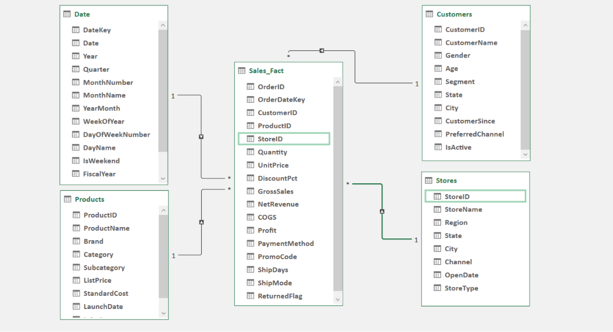

# Agile-Scrum-Business-Intelligence-lifecycle-phase1

Phase 1 of an agile retail BI ecosystem. Leveraged Power Query ETL and star-schema model to isolate operational margin leakages, evaluate category risk metrics, and establish the functional blueprint for enterprise SQL migration.
# Omnichannel Retail Profitability Ecosystem (Phase 1 Portfolio)
**Role:** Agile Business Analyst & Scrum Practitioner
**Methodology:** Full Scrum Framework Execution (3-Sprint Milestone Delivery)
**Core Objective:** Consolidate disparate legacy data streams into a validated
relational prototype, uncover systemic category margin leakages, and map
engineering blueprints for an enterprise SQL database migration.--
## InteractiveProject Directory Map
This repository documents the comprehensive chronological progression of an
enterprise data delivery cycle. Explore the specific lifecycle phases through the
validated documentation directories below:
### 01_Project_Initiation
* **Product Charter & Business Vision Specs
project_vision.md:** Defines the macro problem statements, operational
boundaries, and initial data discovery metrics—exposing that the Electronics division
concentrates 88.37% of corporate sales volume.
* **Scrum Framework & Team Charter
scrum_framework_and_team_charter.md:** Establishes the 2-week sprint cadences,
Scrum ceremony frameworks (Planning, Retrospectives, Reviews), and the
engineering team's strict **Definition of Done (DoD)** criteria.
### 02_requirements_BRD
* **Business Requirements Document BRD
Business_Requirements_Document.md:** Maps executive financial goals directly to
an actionable, prioritized Product Backlog matrix using Fibonacci story-point
estimations.
* **KPI Requirements Reference Specification
KPI_Requirements_Specification.pdf:** The formal, approved stakeholder
requirements reference defining the exact calculations required for AOV, Profit
Margins, and Relative Category Return Rates.
### 03_Data_prototype_Excel
* **Technical Implementation & Metrics Insights
Technical_Implementation_and_Insights.md:** Comprehensive engineering
summary detailing our single-direction Star Schema relationships, visual dashboard
sheet mappings, and an active quality assurance bug log.

* **Sprint 3 UAT & Sign-Off Documentation
Sprint_SignOff_and_UAT_Report.pdf:** Official User Acceptance Testing (UAT)
report confirming that all 6 analytical sheets passed verification checks with the CFO
and business sponsors.
* **Raw Data Silos Directory***
Centralized storage area for the unrefined transactional files (`Customers.csv`,
`Products.csv`, `Stores.csv`, `Sales_Fact.csv`).
* **Validated Retail Data Model Workbench
Retail_data_model.xlsx:** The live, operational prototype file containing the data
modeling pipeline, DAX metrics engine, and finalized interactive Pivot Tables.--
## KeyStrategicDiscovery: TheGrocery Profit Trap
Through the construction of custom relational metrics on **Sheet 3 (Return Rate
Analytics)**, the analytical layer successfully isolated a hidden operational threat:
* **The RevenueAnomaly:** The**Grocery** category contributes a near-invisible
**0.37%** of sales volume and **0.36%** of net profit.
* **The Operational Drag:** Despite producing near-zero financial value, Grocery
exhibits a **3.28% absolute return rate**—operating at a massive **61.58% return
intensity relative to our high-volume Electronics baseline**.
* **Strategic Recommendation:** The operational cost of reverse logistics and
restocking high-frequency grocery items completely wipes out its profit margin.
Leadership has formally recommended this product line for strategic vendor
renegotiation or decommissioning.--
## Sprint3RetrospectiveAction Item (Bridge to Phase2)
While this local environment successfully validated all financial business rules, the
team identified strict scaling constraints regarding cloud automated gateways, Row
Level Security (RLS), and dataset refresh concurrency.
* **Agile Resolution:** Officially authorize the technical spike to transition from flat
file architectures into an enterprise corporate data stack.
### [ViewPhase2:Relational SQL DatabaseArchitecture& PowerBI
Deployment (Repository 2)]
